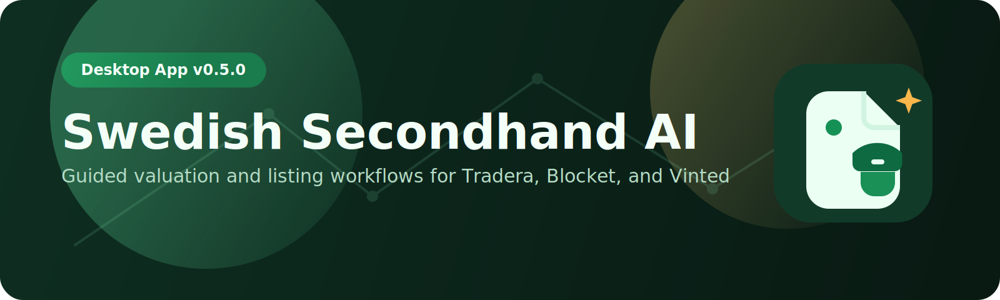

  

  

# Swedish Secondhand AI

Desktop-first valuation and listing assistant for Swedish secondhand markets.

## What's New in v0.5.0

- Guided listing workflow: `Analyze -> Comparables -> Price -> Templates -> Review`.
- Draft autosave and resume across app restarts.
- One-click `Run full pipeline` orchestration.
- Pricing strategies: `fast_sale`, `balanced`, `max_value`.
- Comparable normalization and outlier handling in valuation.
- Confidence explanation breakdown (similarity, sample size, source quality, calibration).
- History outcome capture (`pending`, `sold`, `not_sold`) with sold-price feedback loop.
- Marketplace assist layer with per-site policy checks and quality scoring.
- Publish-readiness gate and actionable fix suggestions per template.
- Copy bundle export per site (title, description, tags, pricing notes).
- Guided workspace layout with persistent summary sidebar.
- Command palette (`Ctrl/Cmd + K`) and keyboard navigation shortcuts.
- History search/filter and detail drill-down.

## Core Capabilities

- Item identification from text or image.
- SEK valuation output with min/recommended/max range.
- Hybrid comparables: Tradera API + manual Blocket/Vinted comps.
- Tradera, Blocket, Vinted template generation with site-specific optimization.
- Local-first storage for settings, manual comps, drafts, and history.
- Swedish-first UI with English fallback.

## Guided Workflow

1. Analyze item from text/images.
2. Fetch Tradera comparables and add manual comps.
3. Choose pricing strategy and estimate value.
4. Generate site templates and quality checks.
5. Review readiness, copy/export bundle, and save to history.

## Keyboard Shortcuts

- `Ctrl/Cmd + K` — Open command palette
- `Ctrl/Cmd + Enter` — Run full pipeline
- `Alt + ArrowRight` — Next workflow step
- `Alt + ArrowLeft` — Previous workflow step

## Tech Stack

- React 18 + TypeScript + Vite
- Electron 40
- Zustand
- idb-keyval
- i18next
- Vitest + Playwright

## Scripts

- `npm run dev`
- `npm run electron:dev`
- `npm run test`
- `npm run test:e2e`
- `npm run validate`
- `npm run dist`

## API Notes

- Tradera comparables use official API access.
- Blocket and Vinted remain manual-posting workflows (no scraping/direct publishing).
- Gemini and Tradera API keys are user-provided and encrypted through the operating system's
  protected credential storage. The renderer receives only configured/not-configured status.

## Build Targets

- Windows (NSIS + portable)
- Linux (AppImage)

## Documentation

- [User Guide](./USER_GUIDE.md)
