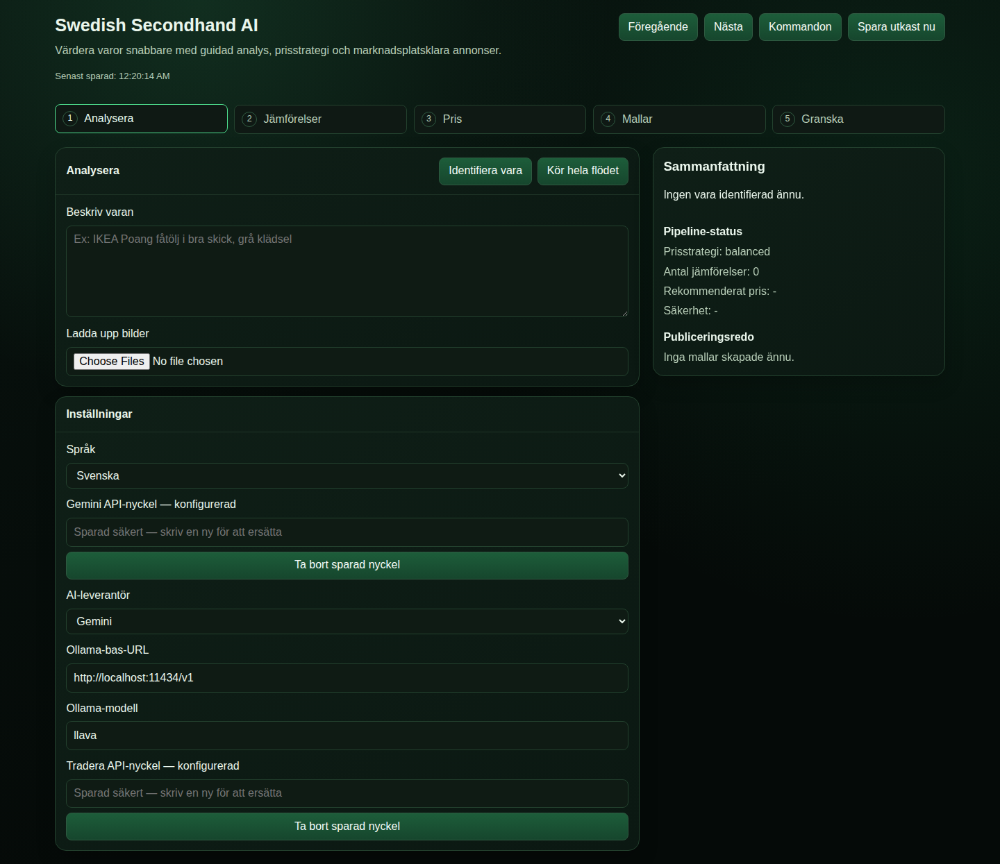
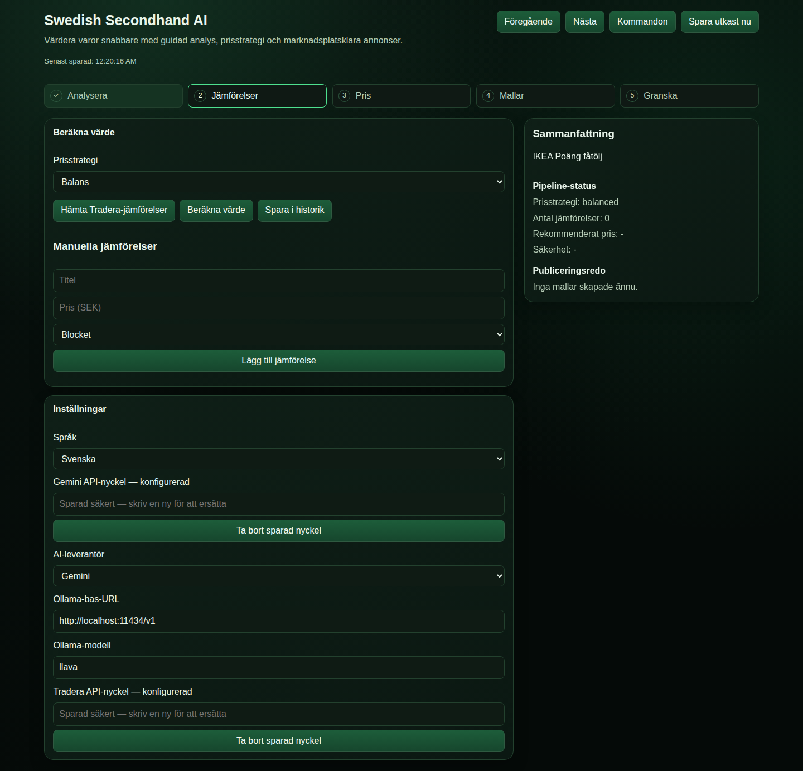
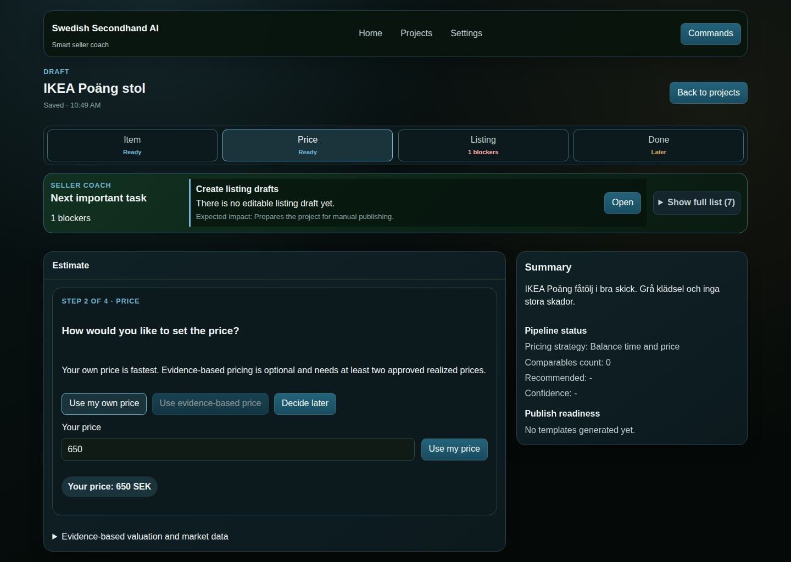
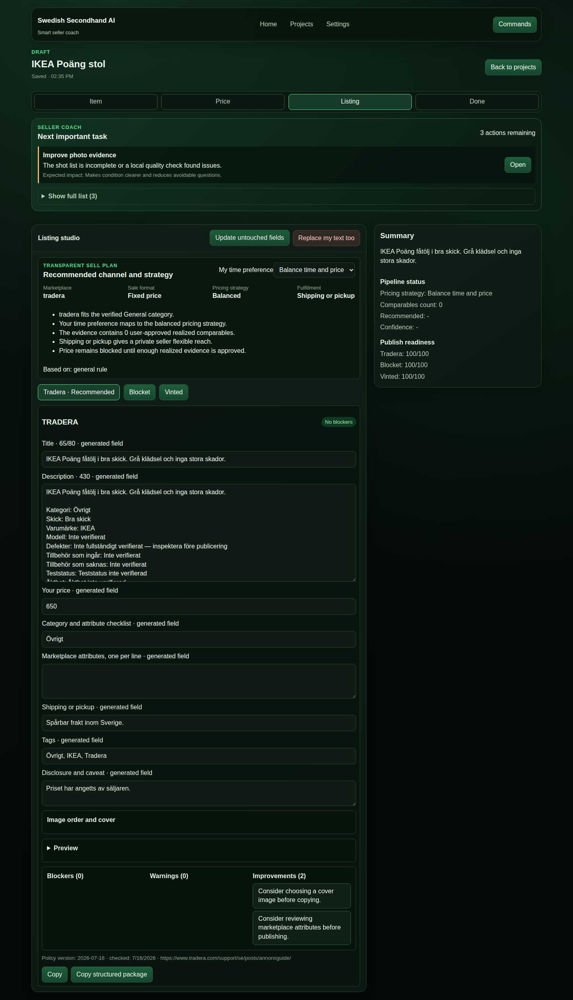
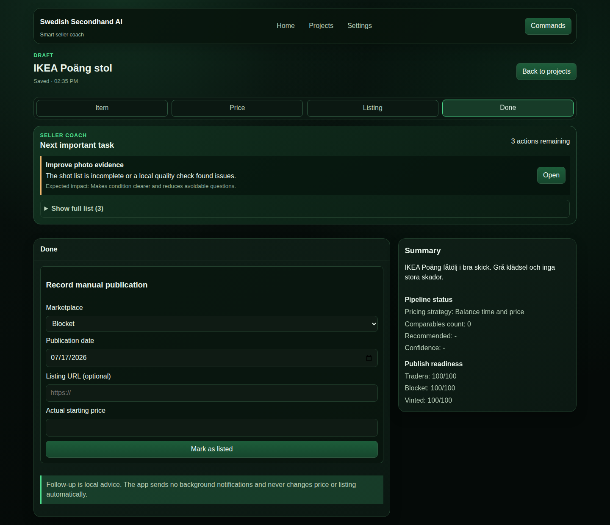
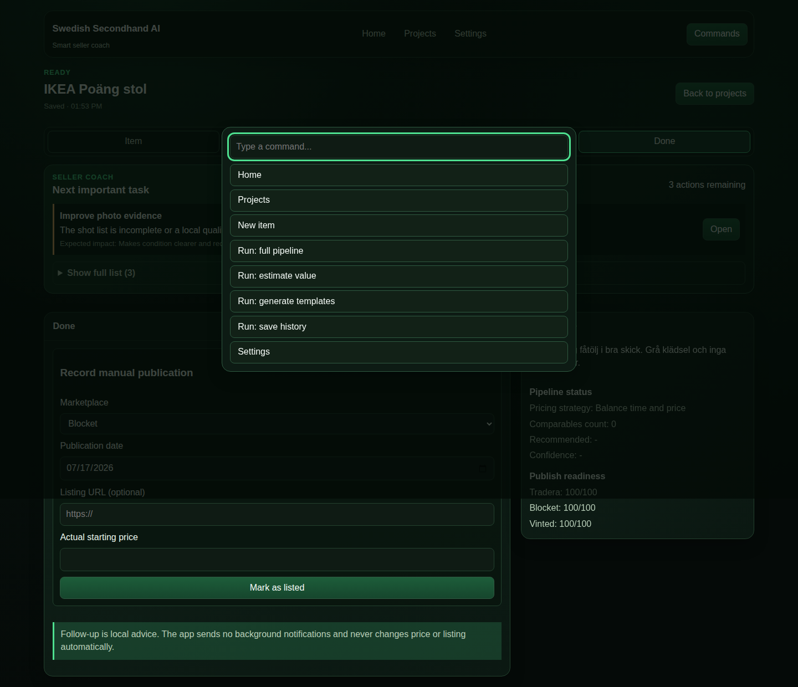

# Swedish Secondhand AI — v2 development user guide

This guide covers the local project-based workflow. Existing screenshots show the v1 visual
baseline and will be regenerated only through `npm run docs:screenshots` for the v2 beta.

## 1. Home and projects

The app opens on **Home**, where recent items and counts for each project state are visible.
**Projects** shows the complete local library. Create one project per item; projects can be:

- draft;
- ready;
- listed;
- sold;
- paused.

Opening a project gives four focused sections: **Item**, **Market & price**, **Listing**, and
**Follow-up**. Settings and backup tools are kept outside the item workflow.

## 2. Analyze Your Item

In **Analyze**:

1. Write a clear item description (brand, condition, model, defects, accessories).
2. Upload 1-6 images.
3. Click **Identify item**.

Review the detected facts before pricing. Correct title, category, brand, model, condition,
defects, accessories, and testing status, then keep important user values locked. A new AI
analysis preserves locked values.

The seller coach shows up to three next actions in priority order and opens the relevant field or
project section. Each action includes its reason and expected impact. Home also surfaces the
highest-priority projects.

Uploaded JPEG, PNG, and WebP files are kept unchanged. The local photo coach checks resolution,
light, contrast, possible blur, duplicates, and square-crop risk, then lets you assign each image
as cover, angle, defect, label/model, or accessories. It never edits or improves a photo
automatically. HEIC/HEIF is rejected with an explicit format message.

Electronics, Fashion, Furniture, Collectibles, and General use different required and recommended
fact/photo checklists. AI and offline analysis create source-labelled candidates with uncertainty
and text/image references. These are suggestions only; explicit knowledge gaps are shown instead
of offline guesses.

Tips for better results:

- Include exact model names if known.
- Mention condition details (e.g., "small scratch on armrest").
- Include included extras (charger, remote, box).
- Photograph defects and labels directly, and keep at least one clear cover image.

## 3. Fetch Comparables and Estimate Price

In **Comparables/Price**:

1. Click **Fetch Tradera comparables** (if API key is configured).
2. Add manual comparables from Blocket/Vinted when needed.
3. Include or exclude every comparable and review its visible reason and weight. Excluded rows
   never affect the result.
4. Choose pricing strategy:
   - `fast_sale`
   - `balanced`
   - `max_value`
5. Click **Estimate value**. If fewer than two approved comparables remain, the app returns
   `insufficient-evidence` without a numeric price.

The sidebar shows current recommendation and confidence.

## 4. Generate Templates and Quality Check

In **Templates**:

1. Click **Generate templates**.
2. Review templates for Tradera, Blocket, and Vinted.
3. Check quality score and policy issues.
4. Fix blocking issues before copying.
5. Use:
   - **Copy** (single listing text)
   - **Copy bundle** (title + description + tags + pricing notes)

## 5. Review and History

In **Review/History**:

1. Save your listing result to history.
2. Search and filter previous valuations.
3. Open a history entry to inspect details.
4. Update sale outcome:
   - `pending`
   - `sold` (optionally add sold price)
   - `not_sold`

Outcome updates improve confidence calibration over time.

## 6. Command Palette and Shortcuts

Open command palette with `Ctrl/Cmd + K` to run key actions quickly.

Available shortcuts:

- `Ctrl/Cmd + K` - Open command palette
- `Ctrl/Cmd + Enter` - Run full pipeline
- `Alt + ArrowRight` - Next step
- `Alt + ArrowLeft` - Previous step

## 7. Projects and recovery

The app autosaves the active project. Multiple projects remain isolated from one another.

- The former v1 active draft and history migrate to schema 3 projects once.
- The original schema 2 records are retained as a rollback source throughout the 2.0 line.
- If migration input is corrupt or unsupported, the app opens read-only recovery without
  replacing the old data.

## 8. Settings

Configure in **Settings**:

- Language: Swedish/English
- Gemini API key
- Tradera App ID and App key

Cloud API keys and the Tradera App key are encrypted through the operating system's protected
credential storage. The non-secret Tradera App ID is stored with preferences. Saved secret values
are never shown again; Settings displays only whether a key is configured. On Linux, unlock or
configure the desktop keyring before saving a key.

Without API keys, fallback logic still works, but with lower confidence and fewer comparables.

## 9. Backup, migration, and reset

Settings includes **Backup and data recovery**. A full format-2 backup contains projects and
images; the compact option explicitly excludes images. Backups never include API keys. Imports
validate the complete file before replacing any selected dataset.

Legacy v0.5/current-main IndexedDB payloads migrate automatically to the schema 2 envelope on
first successful read. Corrupt or unsupported payloads are left untouched. Export a backup before
using selective or full non-secret reset, and restart the app after import/reset.

## 10. Troubleshooting

### No Tradera comparables returned

- Verify both the Tradera App ID and App key from the Tradera Developer Center.
- Wait for the 24-hour cache to expire if you need newly listed market context.
- Add manual comparables so valuation can proceed.

Tradera search results are asking-price context unless the source explicitly provides a realized
price. When adding a manual comparable, select **Verified realized price** only when the sale price
is known; unknown and asking prices do not determine the recommendation.

### Template copy is disabled

- Resolve blocking policy issues in template card.
- Re-generate templates after fixing upstream data.

### Confidence is low

- Add better item description.
- Add more relevant manual comparables.
- Record real sold outcomes to improve calibration.

## 11. Recommended Workflow (Quick)

1. Describe + upload images
2. Identify item
3. Fetch/add comparables
4. Estimate with strategy
5. Generate templates
6. Fix blockers and copy bundle
7. Save to history and update sold outcome later
